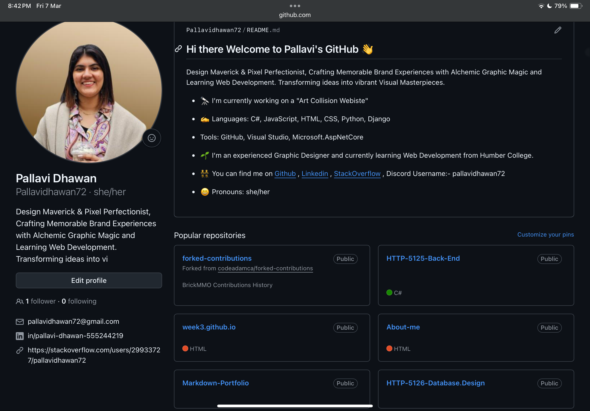

# Interaction Design
This repository shows my projects/assignments of Interaction design using UI/IX elements.

## Information
In this course, I learned UI/UX softwares to make website more interactive. Key topics covered include:

- Using Figma to design layouts
- Strategies and mindstroming about the market trends.

## My Repository

## Links
You can find my GitHub Link Here[GitHub](https://github.com/Pallavidhawan72)
